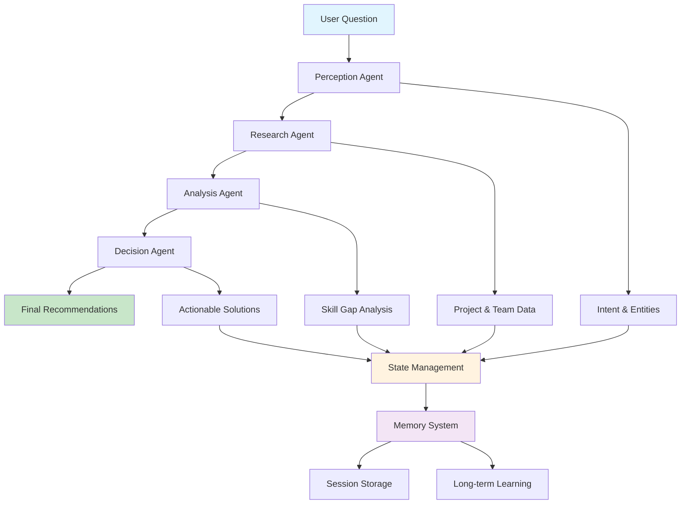
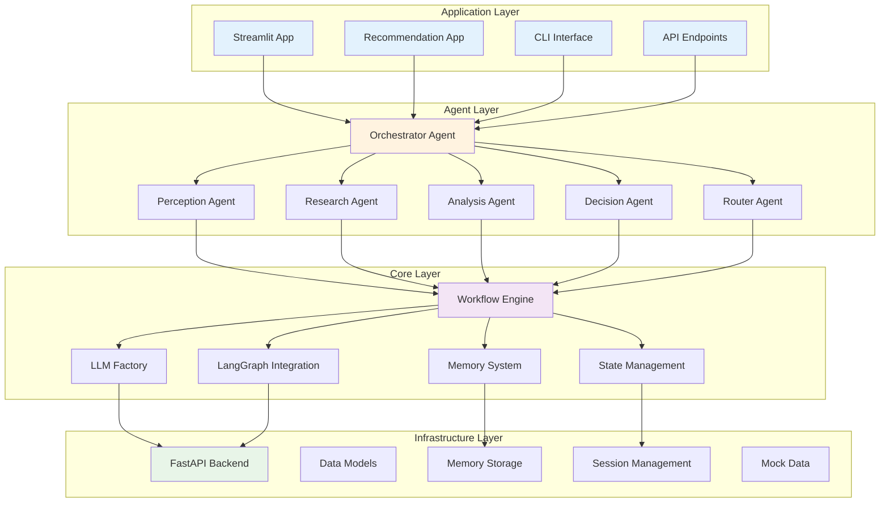

# GapLens Skills Analysis System

An intelligent multi-agent system for analyzing skill gaps and providing team optimization recommendations.

## 🏗️ Architecture Overview

The system uses a **multi-agent cognitive architecture** with specialized agents working together through a **LangGraph workflow**:

### **Agentic Workflow Diagram**



### **System Architecture Layers**



## 🧠 Core Components

### 1. **LLM Factory** (`core/llm_factory.py`)
- **Unified LLM management** supporting multiple backends (Anthropic, Groq, Fake)
- **Reasoning pattern integration** for enhanced AI reasoning
- **Automatic fallback** to fake backend if real APIs fail

### 2. **Agent System** (`agents/`)
- **Base Agent Class** (`base_agent.py`) - Common functionality for all agents
- **Specialized Agents**:
  - **Perception** - Extracts intent and entities (Chain of Thought reasoning)
  - **Research** - Gathers project and team data (REWOO reasoning)
  - **Analysis** - Analyzes skill gaps (REACT reasoning)
  - **Decision** - Makes final recommendations (Tree of Thoughts reasoning)
  - **Orchestrator** - Coordinates workflow (Multi-agent reasoning)
  - **Router** - Accesses external data sources

### 3. **Workflow Engine** (`core/`)
- **LangGraph Integration** - Modern workflow orchestration
- **State Management** - Tracks progress through the analysis pipeline
- **Memory System** - Session and long-term memory for learning

### 4. **API & Infrastructure** (`infrastructure/`)
- **FastAPI Backend** - Comprehensive REST API with mock data
- **Multi-agent Workflow Integration** - Direct API access to the AI workflow
- **Rich Data Models** - Projects, employees, teams, and skills

### 5. **User Interfaces**
- **Recommendation App** (`recommendation_app.py`) - **✅ WORKING** - Focused, streamlined interface for AI recommendations
- **Streamlit App** (`streamlit_app.py`) - **🔄 IN DEVELOPMENT** - Comprehensive interface with all features (more information but not fully functional yet)
- **Command Line Interface** (`main.py`) - **✅ WORKING** - Direct access to the AI workflow system

## 📱 App Status & Usage

### **Current Working Apps**
- **🎯 Recommendation App** - **FULLY FUNCTIONAL**
  - Run with: `streamlit run recommendation_app.py`
  - Focused on AI-powered project recommendations
  - Clean, streamlined interface
  - **Recommended for production use**

- **💻 Command Line Interface** - **FULLY FUNCTIONAL**
  - Run with: `python main.py --question "Your question here"`
  - Direct access to the AI workflow
  - Best for automation and scripting

### **Development Status**
- **🔍 Streamlit App** - **IN DEVELOPMENT**
  - Run with: `streamlit run streamlit_app.py`
  - Comprehensive interface with all features
  - More information and navigation options
  - **Not fully functional yet** - use for exploration only

## 🚀 Quick Start

### 1. Install Dependencies
```bash
pip install -r requirements.txt
```

### 2. Set Environment Variables
```bash
# Create .env file
ANTHROPIC_API_KEY=your_key_here
GROQ_API_KEY=your_key_here
BACKEND=anthropic  # or groq, fake
```

### 3. Start the Backend
```bash
cd infrastructure
python api.py
```

### 4. Start the Frontend (Choose One)

**For Production Use (Recommended):**
```bash
streamlit run recommendation_app.py
```

**For Development/Exploration:**
```bash
streamlit run streamlit_app.py
```

### 5. Run Command Line Interface
```bash
python main.py --question "What skills do we need for a React project?"
```

## 🔧 Configuration

All settings are centralized in `config.py`:

- **LLM Configuration** - Backend selection, models, temperature
- **Display Settings** - Output limits and verbosity
- **Memory Settings** - Retention policies and storage
- **API Configuration** - Endpoints and timeouts
- **Workflow Settings** - Timeouts and retry policies

## 🧪 Testing

### Built-in Tests
```bash
python main.py --test
```

### Interactive Mode
```bash
python main.py --interactive
```

### Fake Backend (No API Keys Required)
```bash
python main.py --backend fake --question "Test question"
```

## 📊 Key Features

### **Intelligent Reasoning Patterns**
- **COT (Chain of Thought)** - Step-by-step analysis
- **REACT** - Reason, Evaluate, Act, Check, Think
- **REWOO** - Reason, Evaluate, Work, Observe, Optimize
- **TOT (Tree of Thoughts)** - Multi-path exploration
- **Multi-Agent** - Coordinated specialist perspectives

### **Comprehensive Data Integration**
- Project requirements and timelines
- Team member skills and experience
- Market data for skills
- Department and role analysis

### **Actionable Recommendations**
- Upskilling opportunities with timelines
- Internal transfer recommendations
- Hiring needs and risk assessment
- Implementation steps and success metrics

## 🏛️ Code Organization

```
GapLens/
├── agents/                 # AI Agent System
│   ├── base_agent.py      # Base class for all agents
│   ├── perception.py      # Intent extraction
│   ├── research.py        # Data gathering
│   ├── analysis.py        # Skill gap analysis
│   ├── decision.py        # Final recommendations
│   ├── orchestrator.py    # Workflow coordination
│   └── router.py          # External data access
├── core/                   # Core System
│   ├── llm_factory.py     # LLM management
│   ├── workflow.py        # High-level workflow
│   ├── langgraph_workflow.py # LangGraph implementation
│   └── memory_system.py   # Memory management
├── infrastructure/         # Backend & API
│   └── api.py             # FastAPI application
├── config.py              # Centralized configuration
├── main.py                # Command line interface
└── streamlit_app.py       # Web interface
```

## 🔄 Recent Simplifications

The codebase has been **significantly simplified** while maintaining all functionality:

> **💡 Current Development Focus**: The recommendation app is fully functional and ready for production use. The comprehensive streamlit app is being enhanced with the recommendation functionality and will be fully operational soon.

1. **Consolidated LLM Factory** - Single source of truth for LLM management
2. **Unified Agent Base Class** - Reduced code duplication by 60%
3. **Cleaner Configuration** - All settings in one organized file
4. **Simplified Imports** - Clear module structure with `__init__.py` files
5. **Maintained Backward Compatibility** - All existing functions still work

## 🤝 Contributing

The system is designed for **extensibility**:

- **Add New Agents** - Inherit from `BaseAgent`
- **New LLM Backends** - Extend the factory pattern
- **Custom Reasoning Patterns** - Add to the enum system
- **Additional Data Sources** - Extend the router system

## 📈 Performance

- **FastAPI Backend** - High-performance async API
- **Efficient Memory System** - Minimal overhead with persistent storage
- **Smart Caching** - Avoids redundant API calls
- **Graceful Degradation** - Falls back to mock data if external sources fail

## 🔒 Security

- **Environment Variables** - No hardcoded API keys
- **Input Validation** - Pydantic models for all data
- **Error Handling** - Graceful failure without exposing internals
- **Mock Data** - Safe testing without real credentials

---

**GapLens** - Making team optimization intelligent, accessible, and actionable.
