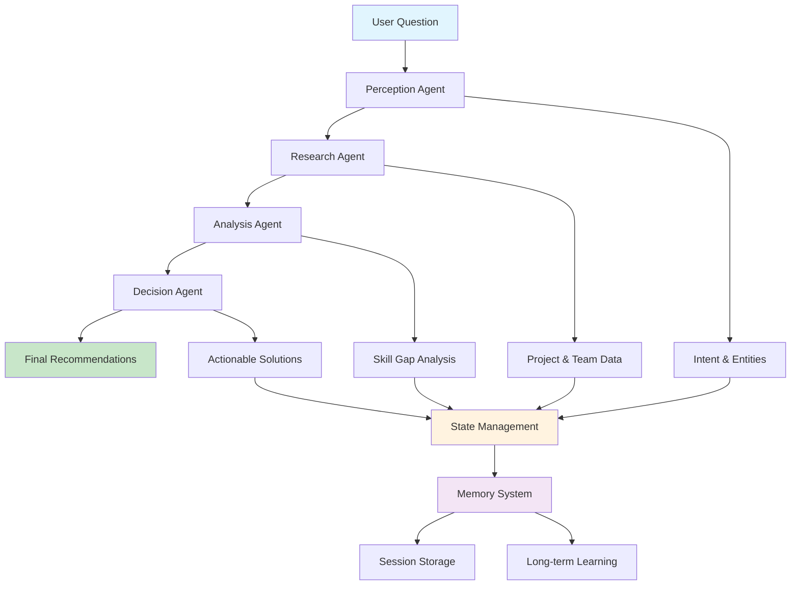
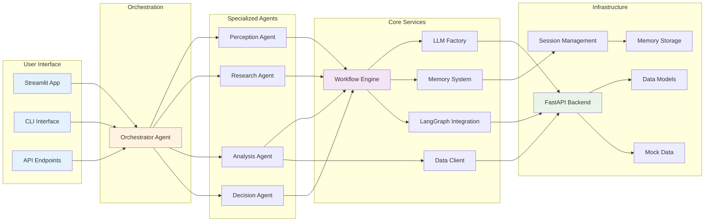

# GapLens Skills Analysis System

An intelligent multi-agent system for analyzing skill gaps and providing team optimization recommendations.

## 🏗️ Architecture Overview

The system uses a **multi-agent cognitive architecture** with specialized agents working together through a **LangGraph workflow**:

### **Agentic Workflow Diagram**



### **System Architecture Layers**



## 🧠 Core Components

### 1. **LLM Factory** (`core/llm_factory.py`)
- **Unified LLM management** supporting multiple backends (Anthropic, Groq, Fake)
- **Reasoning pattern integration** for enhanced AI reasoning
- **Automatic fallback** to fake backend if real APIs fail

### 2. **Agent System** (`agents/`)
- **Base Agent Class** (`base_agent.py`) - Common functionality for all agents
- **Specialized Agents**:
  - **Perception** - Extracts intent and entities (Chain of Thought reasoning)
  - **Research** - Gathers project and team data (REWOO reasoning)
  - **Analysis** - Analyzes skill gaps (REACT reasoning)
  - **Decision** - Makes final recommendations (Tree of Thoughts reasoning)
  - **Orchestrator** - Coordinates workflow (Multi-agent reasoning)

### 3. **Core Services** (`core/`)
- **LangGraph Integration** - Modern workflow orchestration
- **State Management** - Tracks progress through the analysis pipeline
- **Memory System** - Session and long-term memory for learning
- **Data Client** - MCP-pattern data access for agents to server-side resources

### 4. **API & Infrastructure** (`infrastructure/`)
- **FastAPI Backend** - Comprehensive REST API with mock data
- **Multi-agent Workflow Integration** - Direct API access to the AI workflow
- **Rich Data Models** - Projects, employees, teams, and skills

### 5. **User Interfaces**
- **Streamlit App** (`streamlit_app.py`) - **✅ FULLY FUNCTIONAL** - Comprehensive interface with AI recommendations, team analysis, and project management
- **Command Line Interface** (`main.py`) - **✅ WORKING** - Direct access to the AI workflow system

## �� App Status & Usage

### **Main Application**
- **🎯 Streamlit App** - **FULLY FUNCTIONAL**
  - Run with: `streamlit run streamlit_app.py`
  - Comprehensive interface with AI-powered recommendations
  - Team skills analysis and project management
  - Clean, modern UI with styled recommendation cards
  - **Recommended for all users**

### **Additional Tools**
- **💻 Command Line Interface** - **FULLY FUNCTIONAL**
  - Run with: `python main.py --question "Your question here"`
  - Direct access to the AI workflow
  - Best for automation and scripting

## �� Quick Start

### 1. Install Dependencies
```bash
pip install -r requirements.txt
```

### 2. Set Environment Variables
```bash
# Create .env file
ANTHROPIC_API_KEY=your_key_here
GROQ_API_KEY=your_key_here
BACKEND=anthropic  # or groq, fake
```

### 3. Start the Backend
```bash
cd infrastructure
python api.py
```

### 4. Start the Frontend
```bash
streamlit run streamlit_app.py
```

### 5. Run Command Line Interface
```bash
python main.py --question "What skills do we need for a React project?"
```

## �� Configuration

All settings are centralized in `config.py`:

- **LLM Configuration** - Backend selection, models, temperature
- **Display Settings** - Output limits and verbosity
- **Memory Settings** - Retention policies and storage
- **API Configuration** - Endpoints and timeouts
- **Workflow Settings** - Timeouts and retry policies

## �� Testing

### Built-in Tests
```bash
python main.py --test
```

### Interactive Mode
```bash
python main.py --interactive
```

### Fake Backend (No API Keys Required)
```bash
python main.py --backend fake --question "Test question"
```

## 📊 Key Features

### **Intelligent Reasoning Patterns**
- **COT (Chain of Thought)** - Step-by-step analysis
- **REACT** - Reason, Evaluate, Act, Check, Think
- **REWOO** - Reason, Evaluate, Work, Observe, Optimize
- **TOT (Tree of Thoughts)** - Multi-path exploration
- **Multi-Agent** - Coordinated specialist perspectives

### **Comprehensive Data Integration**
- Project requirements and timelines
- Team member skills and experience
- Market data for skills
- Department and role analysis

### **MCP Pattern Architecture**
- **Model Context Protocol** - Agents access server-side data through standardized client
- **Clean Separation** - Data access logic separated from agent logic
- **Scalable Design** - Easy to add new data sources and endpoints

### **Actionable Recommendations**
- Upskilling opportunities with timelines
- Internal transfer recommendations
- Hiring needs and risk assessment
- Implementation steps and success metrics

## ��️ Code Organization
GapLens/
├── agents/ # AI Agent System
│ ├── base_agent.py # Base class for all agents
│ ├── perception.py # Intent extraction
│ ├── analysis.py # Skill gap analysis
│ ├── decision.py # Final recommendations
│ └── orchestrator.py # Workflow coordination
├── core/ # Core System Services
│ ├── llm_factory.py # LLM management
│ ├── workflow.py # High-level workflow
│ ├── langgraph_workflow.py # LangGraph implementation
│ ├── memory_system.py # Memory management
│ └── data_client.py # MCP-pattern data access
├── infrastructure/ # Backend & API
│ ├── api.py # FastAPI application
│ ├── mock_data.py # Sample data
│ └── models.py # Data models
├── config.py # Centralized configuration
├── main.py # Command line interface
└── streamlit_app.py # Web interface


## 🔄 Recent Improvements

The codebase has been **significantly improved** with better organization and cleaner architecture:

> **💡 Current Status**: The Streamlit app is fully functional with clean, robust AI recommendations, team analysis, and project management features. All functionality has been integrated into a single, comprehensive interface.

1. **FastAPI Backend Implementation** - Robust REST API with comprehensive data models and endpoints
2. **Proper Layer Separation** - Data client moved to core layer, agents only in agents/
3. **Code Cleanup** - Removed 388 lines of dead code and unnecessary files
4. **Consolidated LLM Factory** - Single source of truth for LLM management
5. **Unified Agent Base Class** - Reduced code duplication by 60%
6. **Cleaner Configuration** - All settings in one organized file
7. **Simplified Imports** - Clear module structure with `__init__.py` files
8. **Maintained Backward Compatibility** - All existing functions still work
9. **Integrated Recommendation System** - Clean, styled recommendation cards with robust error handling

## 🚀 Future Enhancements

### **High Priority**
- ** Perform Basic Testing **
- **Evaluation & Testing Framework** - Build comprehensive test suite with automated evaluation metrics for agent performance
- **MCP Integration** - Migrate from FastAPI to proper Model Context Protocol for standardized agent-server communication
- **Long-term Memory Training** - Leverage accumulated session data for agent fine-tuning and continuous improvement

### **Medium Priority**
- **Advanced Reasoning Patterns** - Implement additional reasoning frameworks (Self-Reflection, Constitutional AI)
- **Multi-modal Support** - Add support for image and document analysis in skill assessments
- **Real-time Collaboration** - Enable multiple users to work on the same analysis simultaneously
- **Advanced Analytics** - Add predictive modeling for skill demand forecasting

### **Long-term Vision**
- **Federated Learning** - Enable cross-organization learning while maintaining data privacy
- **Custom Agent Training** - Allow users to train specialized agents for their specific domains
- **Integration Ecosystem** - Build connectors for popular HR and project management tools

## 🤝 Contributing

The system is designed for **extensibility**:

- **Add New Agents** - Inherit from `BaseAgent`
- **New LLM Backends** - Extend the factory pattern
- **Custom Reasoning Patterns** - Add to the enum system
- **Additional Data Sources** - Extend the data client system

## 📈 Performance

- **FastAPI Backend** - High-performance async API
- **Efficient Memory System** - Minimal overhead with persistent storage
- **Smart Caching** - Avoids redundant API calls
- **Graceful Degradation** - Falls back to mock data if external sources fail

## 🔒 Security

- **Environment Variables** - No hardcoded API keys
- **Input Validation** - Pydantic models for all data
- **Error Handling** - Graceful failure without exposing internals
- **Mock Data** - Safe testing without real credentials

---

**GapLens** - Making team optimization intelligent, accessible, and actionable.
